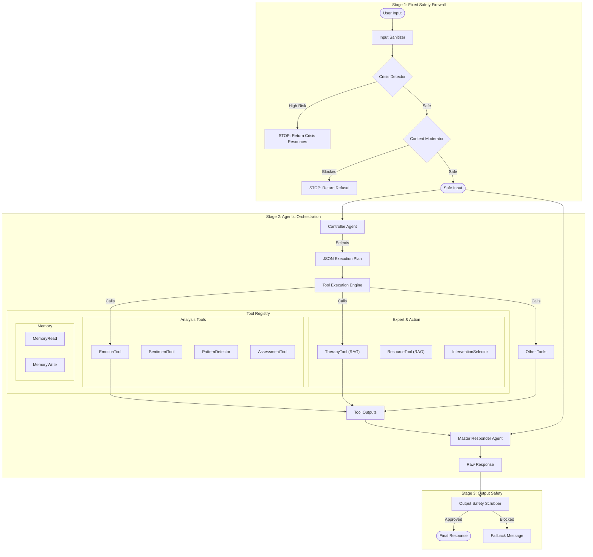

# Hybrid Agentic Architecture: Technical Deep Dive

This document serves as the definitive technical reference for the Mental Health Chatbot's Hybrid Agentic Architecture. It details every component, agent, and logic flow within the system.

## 1. System Philosophy

The architecture is built on the **"Safety-First, Intelligence-Second"** principle.
-   **Deterministic Safety**: Critical safety checks (suicide, abuse) must never rely on a probabilistic LLM. They run in a rigid, code-based pipeline.
-   **Adaptive Intelligence**: Once safety is established, the system becomes "Agentic". A Controller LLM dynamically selects the right tools for the specific user context, avoiding the wastefulness of a fixed linear chain.

## 2. Architecture Diagram

## 3. Component Reference

### 3.1 Stage 1: The Safety Firewall (`safety/`)
These components run sequentially. If any check fails, the pipeline halts immediately.

*   **`InputSanitizer`**:
    *   **Purpose**: Prevents prompt injection and normalizes text.
    *   **Logic**: Uses Regex to strip patterns like `System:`, `Ignore previous instructions`, and excessive whitespace.
    *   **File**: `safety/input_sanitizer.py`

*   **`ImmediateCrisisDetector`**:
    *   **Purpose**: Detects life-threatening situations.
    *   **Logic**: Scans for high-risk keywords (`suicide`, `kill myself`, `overdose`, `weapon`).
    *   **Output**: `risk_level` (High/Medium/None). High risk triggers an immediate hard-coded response with emergency numbers (988, 741741).
    *   **File**: `safety/crisis_detector.py`

*   **`ContentModeration`**:
    *   **Purpose**: Filters illegal, abusive, or hate speech content.
    *   **Logic**: Keyword matching against a blocklist of harmful terms.
    *   **File**: `safety/content_moderation.py`

### 3.2 Stage 2: The Orchestrator (`core/`)

*   **`Controller`**:
    *   **Purpose**: The "Brain" that plans the response strategy.
    *   **Model**: Fast, efficient LLM (e.g., Groq Llama 3 / Qwen).
    *   **Logic**: Receives the user message and available tool descriptions. Outputs a **JSON Plan** listing which tools to call and why. It *does not* write the final response.
    *   **File**: `core/controller.py`

*   **`ToolExecutionEngine`**:
    *   **Purpose**: The "Body" that executes the plan.
    *   **Logic**: Iterates through the Controller's JSON plan, instantiates the requested tools, executes them, and aggregates their results into a context dictionary.
    *   **File**: `core/tool_engine.py`

### 3.3 The Tool Registry (`tools/`)
The specialized agents available to the Controller.

#### Analytical Tools
*   **`EmotionTool`**:
    *   **Function**: Decomposes text into 10+ emotion categories (e.g., Betrayal, Grief, Anger) and assigns intensity scores.
    *   **Use Case**: When the user expresses complex feelings.
*   **`SentimentTool`**:
    *   **Function**: Calculates a simple polarity score (-1.0 to +1.0).
    *   **Use Case**: Quick check of user vibe (positive/negative).
*   **`PatternDetectorTool`**:
    *   **Function**: Analyzes conversation history to find repetitive loops or recurring themes.
    *   **Use Case**: When a user seems stuck or repeats the same issue.
*   **`AssessmentTool`**:
    *   **Function**: Scans for clinical symptoms mapping to PHQ-9 (Depression) or GAD-7 (Anxiety).
    *   **Use Case**: When clinical tracking is needed.

#### RAG (Retrieval-Augmented) Tools
*   **`TherapyTool`**:
    *   **Function**: Semantic search over a database of CBT/DBT coping strategies. Uses an LLM to synthesize the retrieved docs into a friend-like suggestion.
    *   **Use Case**: When the user needs practical advice or coping mechanisms.
*   **`ResourceTool`**:
    *   **Function**: Semantic search over a database of professional resources (hotlines, therapy types).
    *   **Use Case**: When the user asks for professional help or definitions.

#### Memory Tools
*   **`MemoryReadTool`**: Retrieves past session summaries and recent history.
*   **`MemoryWriteTool`**: Updates the session summary with new key information.

#### Action Tools
*   **`InterventionSelectorTool`**: Uses heuristics to recommend high-level therapeutic approaches (e.g., "Validation First", "Grounding Technique").
*   **`MasterResponderTool`**:
    *   **Function**: The final synthesizer.
    *   **Logic**: Takes the User Message + All Tool Results + Safety Context. Uses a powerful LLM (Llama 3.3 70B) to generate the final, empathetic, human-like response.

### 3.4 Stage 3: Post-Processing (`safety/`)

*   **`OutputSafetyScrubber`**:
    *   **Purpose**: Final quality control.
    *   **Logic**: Scans the generated response for:
        *   Leaked system internals (e.g., "JSON", "System Prompt").
        *   Policy violations.
    *   **Action**: If a violation is found, it blocks the response and returns a safe fallback.
    *   **File**: `safety/output_scrubber.py`

## 4. Execution Flow Example

**Scenario**: User says *"I feel hopeless and nothing I try works."*

1.  **Stage 1 (Safety)**:
    *   `InputSanitizer`: Cleans text.
    *   `CrisisDetector`: Checks "hopeless". Result: Medium Risk (not immediate danger).
    *   `ContentModeration`: Pass.
    *   **Result**: Proceed to Stage 2.

2.  **Stage 2 (Controller)**:
    *   **Input**: "I feel hopeless and nothing I try works."
    *   **Decision**:
        *   User is emotional -> Call `EmotionTool`.
        *   User mentions "nothing works" (pattern) -> Call `PatternDetectorTool`.
        *   User needs help -> Call `TherapyTool`.
        *   Final Step -> Call `MasterResponderTool`.

3.  **Stage 2 (Execution)**:
    *   `EmotionTool`: Returns `{"primary": "hopelessness", "intensity": "high"}`.
    *   `PatternDetectorTool`: Returns `{"loop_detected": true, "theme": "failed_coping"}`.
    *   `TherapyTool`: Retrieves "Behavioral Activation" strategies. Returns "Try doing one small thing..."
    *   `MasterResponderTool`: Synthesizes all above.
        *   *Draft*: "I hear how heavy that hopelessness feels (validating Emotion). It makes sense you're tired of trying things that don't help (validating Pattern). Maybe we can start smaller..."

4.  **Stage 3 (Scrubber)**:
    *   Checks draft for leaks.
    *   **Result**: Approved.

5.  **Final Output**: Displayed to user.
